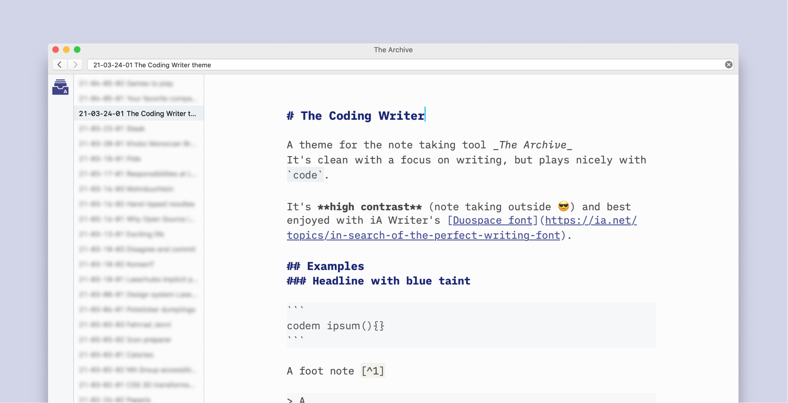
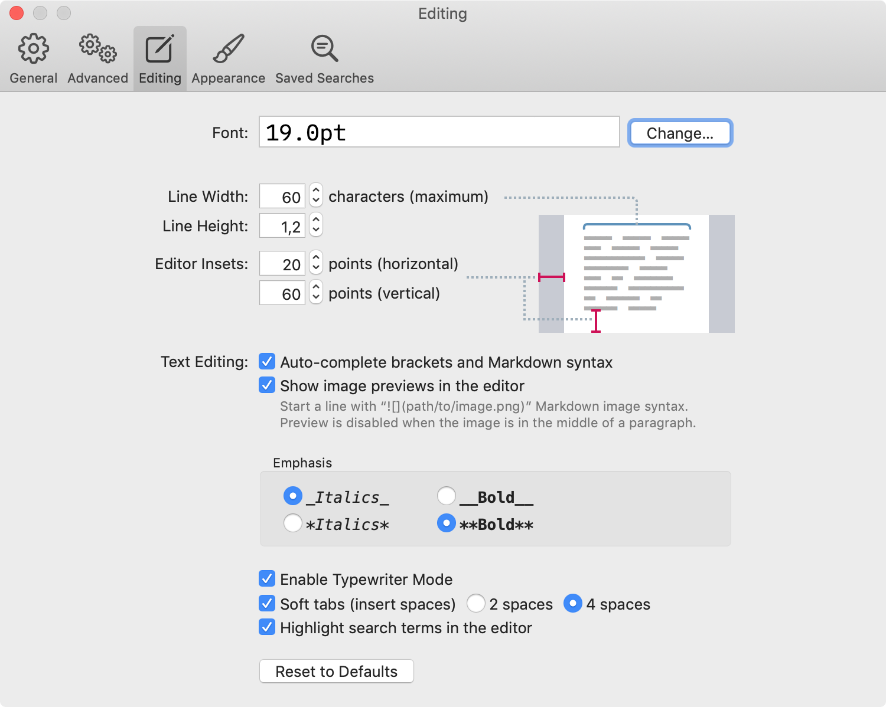

# The Coding Writer theme
A theme for the note taking tool [The Archive](https://zettelkasten.de/the-archive/). 
It's clean with a focus on writing, but plays nicely with `code`.

It's **high contrast** (note taking outside 😎) and best enjoyed with iA Writer's [Duospace font](https://ia.net/topics/in-search-of-the-perfect-writing-font).

## Install
1. Go to `/Users/{username}/Library/Application Support/TheArchive/Themes`
	- Alternatively open The Archive's **settings**, go to **Appearance**, click **Open theme manager** and click **Open Theme Directory**)
3. **Download** the `The Coding Writer.theme.json`-file from this repository and **drag** it into the folder
4. In The Archive's **settings** under **Appearance**, you can now select "The Coding Writer" from the "Light theme"-dropdown (you might need to close The Archive first though)
5. Done (but I recommend downloading and using the [iA Writer Duospace font](https://github.com/iaolo/iA-Fonts/tree/master/iA%20Writer%20Duospace) with the theme)

## Configuration
I use the following settings inside The Archive:

